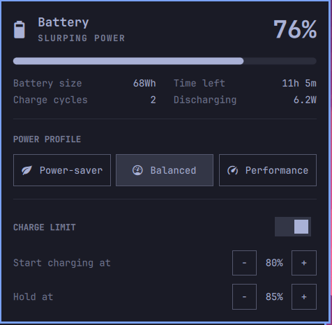

# omarchy-battery-management

Omarchy's built-in battery/power panel with a **Charge limit** section added under **Power profile**.



- **Toggle off**: no limit. The battery charges to 100% (Dell "Express" mode).
- **Toggle on**: set **Start charging at** and **Hold at** with the −/+ steppers, then press **Apply**.

Each change asks for your password through Omarchy's polkit dialog, because it writes battery settings stored in the BIOS. The settings persist across reboots.

## Hardware: tested on one laptop only

| | |
|---|---|
| Laptop | Dell XPS 14 DA14260 (SKU 0DB9) |
| CPU | Intel Core Ultra X7 358H (Panther Lake) |
| OS | Omarchy 4.0.4, kernel 7.2.5 |

It relies on Dell's `dell_laptop` kernel driver exposing these files:

```
/sys/class/power_supply/BAT0/charge_types                   # must list [Custom]
/sys/class/power_supply/BAT0/charge_control_start_threshold
/sys/class/power_supply/BAT0/charge_control_end_threshold
```

Other Dell models with that driver will probably work. ThinkPad, ASUS, Framework, and other laptops use different drivers, modes, and limits. On those, this will fail or do nothing, so don't use it there without adapting `bin/battery-charge-limit.sh`.

Firmware rules, which the panel and the script both enforce:

- **Start charging at**: 50–95%
- **Hold at**: 55–100%
- **Gap**: Hold at must be at least 5% above Start charging at

## Install

```bash
git clone https://github.com/Abhishek-1804/omarchy-battery-management ~/.config/omarchy/plugins/abhishek.power
omarchy plugin enable abhishek.power
```

This replaces the stock `omarchy.power` bar widget. If the old panel still shows, run `omarchy restart shell`.

## Command line

The panel calls the bundled script, which you can also run directly:

```bash
bin/battery-charge-limit.sh --custom 80 85   # Custom mode: start at 80%, hold at 85%
bin/battery-charge-limit.sh --normal         # no limit: Fast/Express, charges to 100%
```

`--normal` also stores 50/90 as the custom values, which was this laptop's original state. The firmware ignores those values outside Custom mode, but sysfs still reports them.

## Credits

The panel is a clone of Omarchy's `omarchy.power` plugin (MIT, https://github.com/basecamp/omarchy), made with `omarchy plugin clone omarchy.power`. The charge-limit section and `bin/battery-charge-limit.sh` are the only additions.
